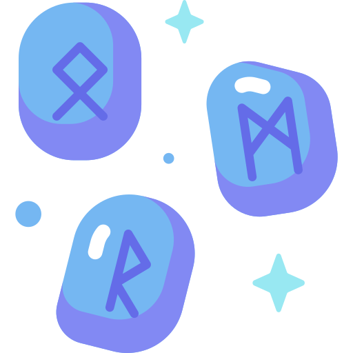

# <div align="center"></div>
<h1 align="center">Rune Lab</h1>

[](https://www.npmjs.com/package/rune-lab)
[](https://github.com/Yrrrrrf/rune-lab)
[](https://choosealicense.com/licenses/mit/)

## Overview

Rune Lab is a SvelteKit component library **designed for the SvelteHack 2024**. It provides a collection of reusable UI components and utilities built with modern web technologies. The library emphasizes type safety, performance, and developer experience.

## Features

- **Svelte 5 Ready**: Built with the latest Svelte features
- **TypeScript Support**: Full type safety and IDE integration
- **Tailwind CSS**: Utility-first styling with custom components
- **Zero Dependencies**: Lightweight and efficient
- **Hot Reload**: Development-friendly with watch mode
- **JSR Distribution**: Modern package distribution

<!-- ## Installation -->
<!-- 
```bash
jsr add @rune-lab
# jsr add @yrrrrrf/rune-lab
``` -->

## Usage

### Components

TODO
TODO
TODO
TODO
TODO

## Development

```bash
bun install  # Install dependencies
bun watch  # Start development watch mode
bun run build  # Build library
bun test  # Run tests
```

## Project Structure

```
rune-lab/
├── src/
│   └── lib/
│       ├── components/
│       ├── utils/
│       └── index.ts
├── tests/
├── watch.ts
└── package.json
```

## License

MIT License - [LICENSE](LICENSE)